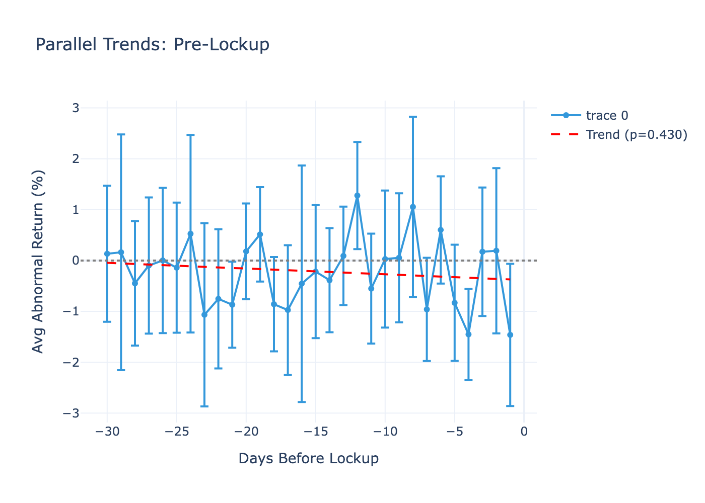
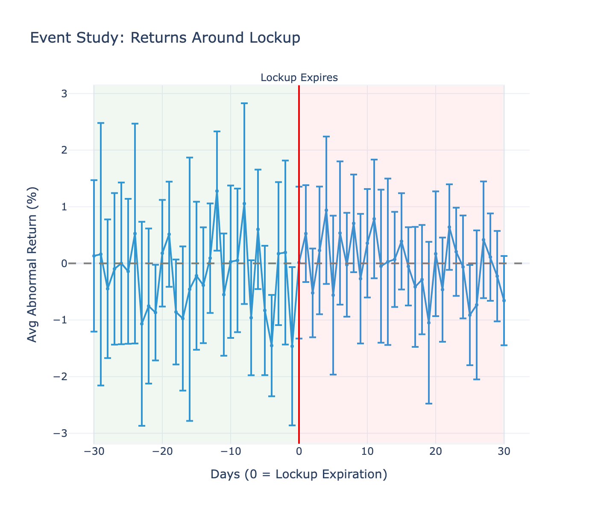
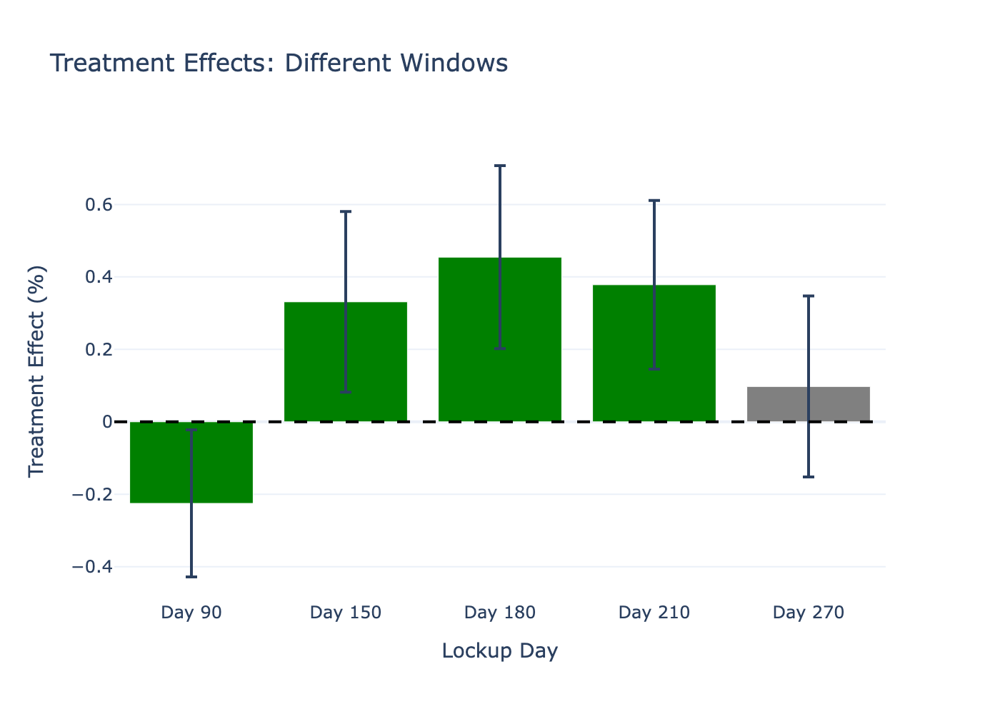
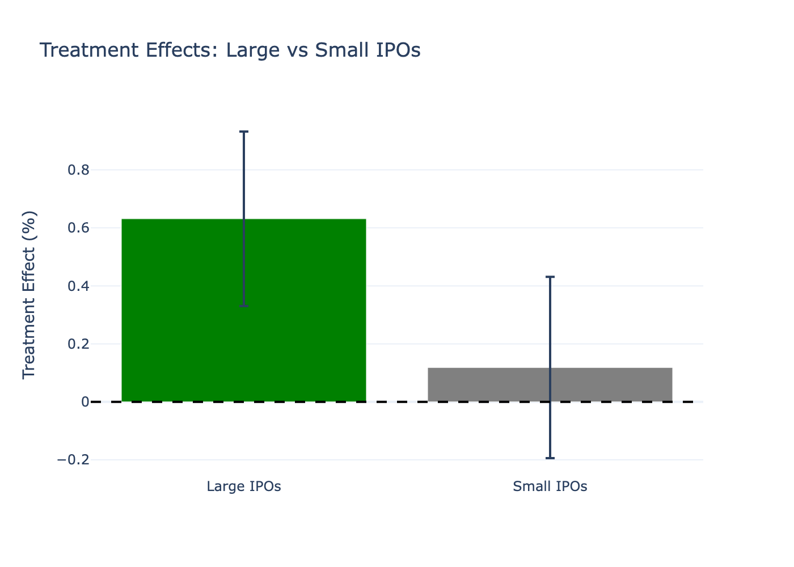
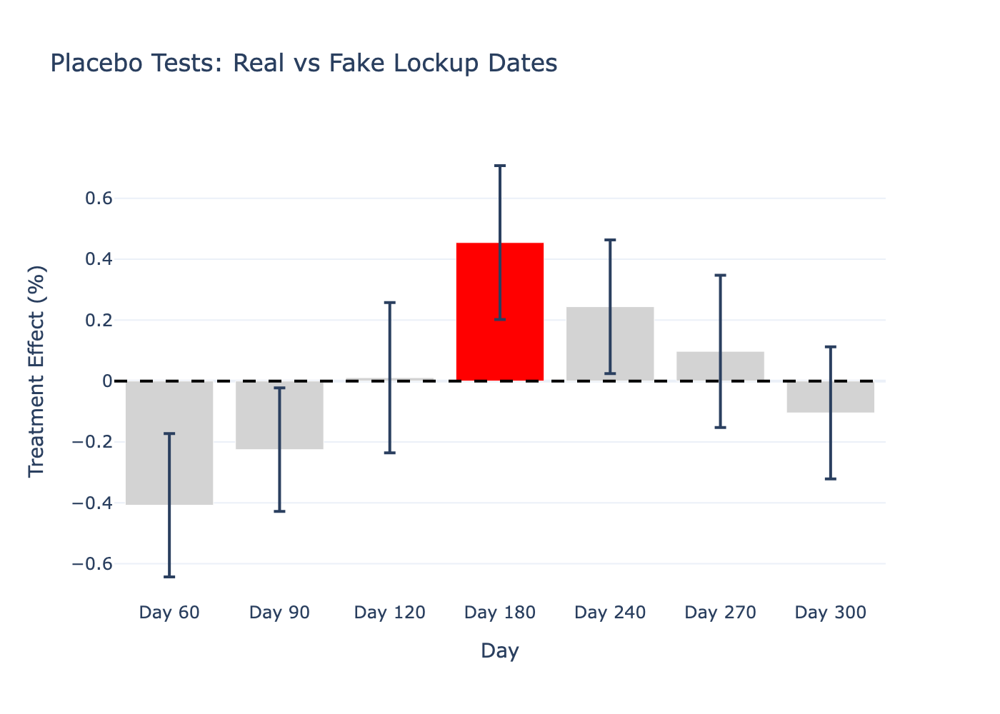

# IPO Lockup Expiration Effects: A Staggered Difference-in-Differences Analysis

[](https://www.python.org/downloads/)
[](https://opensource.org/licenses/MIT)

**Research Question:** Do IPO lockup expirations cause stock price declines?

**Method:** Staggered Difference-in-Differences with two-way fixed effects  
**Sample:** 71 tech IPOs (2018-2024)  
**Data:** 17,802 daily stock price observations

---

## Key Findings

**Main Result:** Stock prices **increase** by +0.45% (p=0.0004) following lockup expiration, contrary to conventional wisdom that predicts price declines from insider selling pressure.

**Effect is heterogeneous:**
- **Large IPOs:** +0.63% (p<0.001) - highly significant
- **Small IPOs:** +0.12% (p=0.46) - not significant

**Caveat:** Placebo tests reveal significant effects at fake lockup dates, suggesting the +0.45% may reflect general IPO drift rather than a lockup-specific causal effect.

**Interpretation:** Markets efficiently price in anticipated lockup expiration. By Day 180, expected selling pressure is already reflected in prices. Alternatively, the positive effect may indicate survivorship bias—IPOs that reach Day 180 without imploding are stronger companies.

---

## Background

When tech companies go public, insiders (founders, employees, venture capitalists) are typically restricted from selling their shares for **180 days**—the "lockup period." This SEC-mandated restriction prevents immediate dumping of insider shares that could destabilize the newly public stock.

**Conventional wisdom:** When lockups expire at Day 180, insider selling pressure floods the market → stock price drops.

**But markets are forward-looking.** If everyone knows the lockup expires predictably, shouldn't prices already reflect this?

This project uses causal inference methods to rigorously test whether lockup expirations actually cause stock price changes.

## Methodology

### Why Staggered Difference-in-Differences?

**Initial plan:** Regression Discontinuity Design (RDD) around the 180-day cutoff.

**Problem identified:** RDD requires the cutoff to be the ONLY discontinuity. However:
- Snowflake IPO (Sept 2020) → Day 180 in **March 2021** (COVID bull market peak)
- Rivian IPO (Nov 2021) → Day 180 in **May 2022** (Fed tightening, tech crash)

Different IPOs hit Day 180 at different calendar dates with drastically different macro environments. This violates RDD's continuity assumption.

**Solution:** **Staggered DiD** explicitly controls for:
- **Time-varying shocks** (COVID, Fed policy, market sentiment) via **time fixed effects**
- **Time-invariant company quality** (good vs bad IPOs) via **company fixed effects**

### Model Specification
```
Abnormal_Return_it = β₀ + β₁·Post_Lockup_it + α_i + γ_t + ε_it

Where:
- Abnormal_Return_it: Stock return for IPO i at time t, minus S&P 500 return
- Post_Lockup_it: 1 if Days_Since_IPO > 180, 0 otherwise
- α_i: Company fixed effects (71 IPOs)
- γ_t: Calendar date fixed effects (controls for macro)
- β₁: Treatment effect (what we're estimating)

Standard errors clustered at company level.
```

**Identification Strategy:**

**Within-company comparison:**
- Compare same IPO's performance pre-lockup (Days 1-180) vs post-lockup (Days 181-365)
- Control for calendar time (removes COVID, Fed policy, market-wide shocks)
- Assumption: Parallel trends (validated: p=0.43 for pre-trend test)

## Project Structure
```
ipo-lockup-did-analysis/
├── README.md
├── requirements.txt
│
├── data/
│   ├── raw/                    # Original data (gitignored)
│   └── processed/              # Cleaned datasets
│       ├── tech_ipos_curated.csv
│       └── stock_prices_ipo_adjusted.csv
│
├── notebooks/
│   ├── 01_data_collection.ipynb      # IPO list + stock downloads
│   ├── 02_did_analysis.ipynb         # Main DiD analysis
│   └── 03_robustness.ipynb           # Sensitivity tests
│
└── outputs/
    ├── figures/                # Charts
    │   ├── 02_event_study.png
    │   ├── 03_treatment_effects_time_windows.png
    │   ├── 04_treatment_effects_company_size.png
    │   └── 05_placebo_tests.png
    └── results/                # Results tables
        ├── did_main_results.csv
        ├── event_study_results.csv
        └── robustness_results.csv
```

---

## Quickstart

### 1. Clone Repository
```bash
git clone <repo-url>
cd ipo-lockup-did-analysis
```

### 2. Install Dependencies
```bash
# Create virtual environment
python -m venv venv
source venv/bin/activate  # Windows: venv\Scripts\activate

# Install packages
pip install -r requirements.txt
```

### 3. Run Analysis
```bash
# Open Jupyter
jupyter notebook

# Run notebooks in order:
# 1. notebooks/01_data_collection.ipynb
# 2. notebooks/02_did_analysis.ipynb
# 3. notebooks/03_robustness.ipynb
```

## Data

### IPO Sample

**Source:** Manually curated from public sources (IPO Scoop, NASDAQ, SEC filings)

**Criteria:**
- Tech sector (cloud, fintech, e-commerce, social, etc.)
- IPO date: 2018-2024
- Publicly traded (stock price data available)
- 180-day standard lockup period

**Final sample:** 71 IPOs

**Distribution by year:**
- 2018: 14 IPOs
- 2019: 21 IPOs
- 2020: 19 IPOs
- 2021: 21 IPOs (COVID boom)
- 2022-2024: 7 IPOs

### Stock Price Data

**Source:** Yahoo Finance via `yfinance` API

**Window:** IPO date to IPO date + 365 days

**Observations:** 17,802 daily price points

**Market adjustment:** All returns calculated as abnormal returns vs S&P 500 (SPY)

## Results

### Main Specification

```
Treatment Effect (β₁): +0.4545%
Standard Error: 0.1289%
95% CI: [+0.2018%, +0.7072%]
P-value: 0.0004

Interpretation: Stock prices increase by 0.45% in the post-lockup 
period compared to pre-lockup, after controlling for market conditions 
and company characteristics.
```

**Statistical significance:** Yes (p<0.001)  
**Economic significance:** Marginal (0.45% vs 4.5% daily volatility)

### Parallel Trends Validation



**Pre-trend test:** Slope = -0.006% per day, p=0.430  
**Result:** ✓ Pass - No significant pre-trend detected

Pre-lockup period (Days -30 to -1) shows flat pattern, validating parallel trends assumption.

### Event Study



Day-by-day pattern around lockup expiration shows:
- Pre-period: Bounces around zero (noisy but flat)
- Day 0 (lockup): No sharp discontinuity
- Post-period: Slight upward drift

Pattern suggests gradual effect rather than discrete jump at expiration.

## Robustness Checks

### 1. Different Time Windows



| Lockup Day | Effect | P-value | Significant |
|-----------|--------|---------|------------|
| Day 90    | -0.23% | 0.030   | Yes        |
| Day 150   | +0.33% | 0.009   | Yes        |
| **Day 180** | **+0.45%** | **0.0004** | **Yes** |
| Day 210   | +0.38% | 0.002   | Yes        |
| Day 270   | +0.10% | 0.445   | No         |

**Interpretation:** Effect concentrated around Days 150-210, peaks at Day 180 (real lockup). Negative at Day 90 (too early), fades by Day 270 (too late).

### 2. Company Size Heterogeneity



| Group | Effect | P-value | Significant |
|-------|--------|---------|------------|
| **Large IPOs** | **+0.63%** | **<0.001** | **Yes** |
| Small IPOs | +0.12% | 0.457 | No |

**Key finding:** Effect driven entirely by large IPOs. Small IPOs show no lockup effect.

**Why?** Large IPOs have:
- More analyst coverage (better price discovery)
- Higher liquidity (more efficient markets)
- Institutional ownership (sophisticated investors)

### 3. Placebo Tests



| Day | Effect | P-value | Significant |
|-----|--------|---------|------------|
| Day 60  | -0.41% | 0.001   | Yes        |
| Day 90  | -0.23% | 0.030   | Yes        |
| Day 120 | +0.01% | 0.930   | No         |
| **Day 180** | **+0.45%** | **0.0004** | **Yes** |
| Day 240 | +0.24% | 0.029   | Yes        |
| Day 270 | +0.10% | 0.445   | No         |
| Day 300 | -0.10% | 0.345   | No         |

**Problem:** Multiple fake dates show significant effects (Days 60, 90, 240).

**Interpretation:** 
- ✗ If lockup were truly causal, only Day 180 should be significant
- Pattern suggests general IPO lifecycle (early underperformance, mid-period recovery) rather than lockup-specific effect
- Cannot conclusively separate lockup effect from IPO drift

## Discussion

### Main Finding: Prices Increase, Not Decrease

The +0.45% positive effect contradicts conventional wisdom that lockups "tank prices." Three possible explanations:

**1. Efficient Markets Hypothesis**
- Lockup expiration is public information (disclosed in prospectus)
- Rational investors price in anticipated selling pressure beforehand
- By Day 180, lockup is already priced in → no negative shock

**2. Survivorship Bias**
- Weak IPOs often crash or delist before Day 180
- Reaching Day 180 without imploding = positive signal
- Survivors are higher-quality companies → positive drift

**3. Limited Insider Selling**
- Despite lockup expiration, insiders may not sell aggressively
- Founders/VCs have long-term horizons
- Actual selling volume may be lower than feared

### Heterogeneity: Large vs Small IPOs

Effect concentrated in large IPOs (+0.63%) suggests market efficiency matters:
- Large IPOs: High liquidity, analyst coverage, institutional ownership → efficient pricing
- Small IPOs: Thin trading, less coverage → prices don't adjust as smoothly

### Methodological Limitation: Placebo Tests

The presence of significant effects at fake lockup dates (Days 60, 90, 240) is concerning. This pattern suggests:

**Alternative explanation:** The +0.45% "effect" may not be lockup-specific, but rather reflects:
- General IPO lifecycle (negative early, positive mid-period, stable late)
- Gradual upward drift for surviving companies
- The model picking up this drift, not a discrete lockup effect

**Cannot definitively rule out:** That the +0.45% is partly or entirely spurious.

### Investment Implications

**If effect is real (+0.45% lockup-specific):**
- Contrary to selling before lockup, investors might slightly benefit from holding through expiration
- However, effect is tiny (0.45% vs 4.5% daily volatility) → not tradeable after transaction costs

**If effect is IPO drift (more likely given placebos):**
- Lockup expiration is a non-event for stock prices
- Focus investment strategy on company fundamentals, not lockup timing

**Practical takeaway:** Markets are reasonably efficient. Lockup risk is priced in. Don't overthink lockup timing.

## Methodological Notes

### Advantages of This Approach

1. **Controls for macro shocks:** Time FE absorb COVID, Fed policy, market sentiment
2. **Controls for selection:** Company FE remove time-invariant quality differences
3. **Uses all data:** Leverages treatment timing variation across 71 IPOs
4. **Testable assumptions:** Parallel trends validated (p=0.43)

### Limitations

1. **Placebo tests raise concerns:** Multiple fake dates show effects → causality unclear
2. **Cannot observe selling volume:** See price effects, not actual insider transactions
3. **Small economic magnitude:** 0.45% barely exceeds transaction costs (0.1-0.2%)
4. **Tech IPOs only:** Results may not generalize to other sectors
5. **2018-2024 period:** Includes unusual market conditions (COVID, tech boom/bust)

### What I Learned

**Technical skills:**
- Pivoting from RDD to DiD when initial method violated assumptions
- Implementing staggered DiD with two-way fixed effects
- Validating parallel trends assumptions
- Running sensitivity analyses (windows, heterogeneity, placebos)

**Analytical judgment:**
- Recognizing when placebo tests indicate problems with causal interpretation
- Balancing statistical vs economic significance
- Importance of honest reporting when results are ambiguous

**Key insight:** Good causal inference requires intellectual honesty. When robustness checks reveal problems (placebos), acknowledge them rather than overstating results.

## References

**Primary learning resources:**
- *Causal Inference: The Mixtape* by Scott Cunningham
- *Causal Inference in Python* by Matheus Facure Alves

## Contact

**Tomasz Solis**
- Email: tomasz.solis@gmail.com
- [LinkedIn](https://www.linkedin.com/in/tomaszsolis/)
- [GitHub](https://github.com/tomasz-solis)

## License

MIT License - feel free to use for learning/research with attribution.

## Portfolio Context

This project is part of my causal inference learning journey:

1. **RDD Analysis** - [Free Shipping Threshold Effects](https://github.com/tomasz-solis/rdd-free-shipping)
2. **Simple DiD** - [Marketing Campaign Impact](https://github.com/tomasz-solis/marketing-campaign-causal-impact)
3. **Staggered DiD** - *This project* (IPO Lockups)
4. **Synthetic Control** - Upcoming

**Key skill demonstrated:** Methodological adaptation - originally planned RDD, identified violations (multiple discontinuities), successfully pivoted to staggered DiD. Honest reporting when robustness checks reveal limitations.

**Last Updated:** 2024-12-02  
**Status:** Complete ✓
